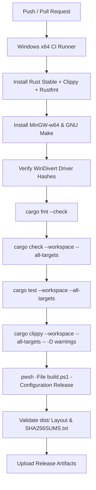

# Build System & CI/CD Pipeline Specification

## 1. Build System Objectives

1. **Deterministic & Reproducible**: Builds produce verifiable binaries from source code.
2. **One-Command Local Compilation**: Developers can clone the repository and run `.\build.ps1` to compile and package all components.
3. **Strict Build Gating**: `build.ps1` mandates toolchain verification and real compilation by default; packaging without compilation is explicitly segregated via `-PackageOnly`.
4. **Automated Continuous Integration**: Every Pull Request and commit is compiled, tested, linted, and verified in GitHub Actions on native Windows x64 runners.
5. **Supply Chain Verification**: Third-party assets (WinDivert driver) are cryptographically validated against pinned SHA-256 hashes during every build.

---

## 2. Prerequisites & Toolchain Requirements

| Component | Required Tool / Version | Purpose |
| :--- | :--- | :--- |
| **Operating System** | Windows 10 (1809+) or Windows 11 (x64) | Target execution environment |
| **Rust Toolchain** | `rustc` 1.80.0+ (stable-x86_64-pc-windows-msvc) with `clippy`, `rustfmt` | Compiles Windows Service and core crates |
| **C Toolchain** | `x86_64-w64-mingw32-gcc` (MinGW-w64) / `gcc` | Compiles userspace GoodbyeDPI & ByeDPI engines |
| **Make Tool** | GNU Make (`make` / `mingw32-make`) | Executes upstream C engine Makefiles |
| **PowerShell** | PowerShell 7+ or Windows PowerShell 5.1 | Automates build and packaging steps |

---

## 3. Local Build Script (`build.ps1`)

`build.ps1` orchestrates the end-to-end compilation pipeline:

```powershell
# Default mode: Full toolchain check, C engine compilation, Cargo tests & build, dist assembly
.\build.ps1 -Configuration Release

# Skip unit tests during build
.\build.ps1 -Configuration Release -SkipTests

# Package-only mode (WARNING: Staging only; no compile validation)
.\build.ps1 -PackageOnly
```

### Pipeline Steps
1. **[1/5] WinDivert Hash Verification**: Runs `third_party\windivert\verify_driver.ps1` to validate the pinned official driver and DLL SHA-256 checksums.
2. **[2/5] Toolchain Availability Check**: Validates that `cargo`, `gcc`, and `make` exist. If any toolchain is missing and `-PackageOnly` is not specified, fails immediately with non-zero exit code (`exit 1`).
3. **[3/5] C Engine Compilation**: Compiles GoodbyeDPI worker and ByeDPI (`ciadpi`) worker from source using MinGW-w64 and Make.
4. **[4/5] Rust Workspace Compilation**: Executes `cargo test --workspace` (unless `-SkipTests`) and `cargo build --release --workspace`.
5. **[5/5] Distributable Assembly & SHA-256 Manifest**: Copies all binaries, profiles, and documentation to `dist/` and generates `SHA256SUMS.txt`.

---

## 4. Distributable Artifact Layout (`dist/`)

```
dist/
├── bin/
│   ├── WinDivert.dll             # Dynamic link library for WinDivert
│   ├── WinDivert64.sys           # Official signed WFP kernel driver
│   ├── goodbyedpi.exe            # Source-built GoodbyeDPI worker executable
│   ├── ciadpi.exe                # Source-built ByeDPI SOCKS5 worker executable
│   └── zondpi-service.exe        # Privileged Windows Background Service
├── profiles/
│   ├── turkey/
│   │   ├── turktelekom.json
│   │   ├── superonline_default.json
│   │   └── byedpi_kaspersky_mode.json
│   └── schema/
│       └── profile.schema.json
├── docs/                         # Architecture, Security, and Compatibility docs
├── LICENSE                       # Project Licenses
├── DEPENDENCIES.md               # Pinned Dependency Manifest
└── SHA256SUMS.txt                # Cryptographic Artifact Checksums
```

---

## 5. GitHub Actions CI Pipeline (`.github/workflows/build-windows.yml`)

The primary CI pipeline executes on Windows x64 (`windows-latest`) on all pushes and pull requests:


