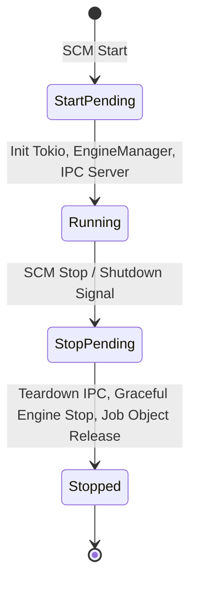

# ZonDPI Windows Service & Lifecycle Specification

## 1. Overview

`zondpi-service.exe` is the backend daemon responsible for managing the lifecycle of DPI circumvention worker engines (`goodbyedpi.exe`, `ciadpi.exe`), exposing the Named Pipe IPC interface, executing compatibility recommendations, and streaming logs.

---

## 2. Windows Service SCM Lifecycle

When started by Windows Service Control Manager (SCM), `zondpi-service` transitions through strict deterministic states:



### Supported SCM Controls
- `ServiceControl::Start`: Transitions SCM to `Running`.
- `ServiceControl::Stop`: Signals graceful teardown of active engines and Named Pipe server.
- `ServiceControl::Shutdown`: Equivalent to Stop on OS shutdown/reboot.
- `ServiceControl::Interrogate`: Responds with current status without altering state.

---

## 3. Foreground / Development Mode

For debugging and testing without installing to SCM:
```powershell
# Run in foreground console mode
zondpi-service.exe --foreground
# Or
zondpi-service.exe run
```
Foreground mode runs identical `EngineManager`, `RuntimePaths`, and `IpcServer` logic, with `Ctrl+C` handling initiating identical graceful cleanup.

---

## 4. SCM Management Subcommands

The service binary includes built-in SCM management subcommands (requiring Administrator privileges):

```powershell
# Install service in Windows SCM (OnDemand start type)
zondpi-service.exe install

# Start the service via SCM
zondpi-service.exe start

# Query service status via SCM
zondpi-service.exe status

# Stop the service via SCM
zondpi-service.exe stop

# Uninstall service from SCM
zondpi-service.exe uninstall
```

---

## 5. Process Supervision & Windows Job Objects

To guarantee zero orphaned worker processes on crash, kill, or unexpected parent termination, ZonDPI enforces Windows Job Object containment:

1. **Job Object Creation**:
   - Win32 `CreateJobObjectW`
   - Configured with `JOBOBJECT_EXTENDED_LIMIT_INFORMATION` setting `JOB_OBJECT_LIMIT_KILL_ON_JOB_CLOSE`.
2. **Process Assignment**:
   - Freshly spawned worker child process handles are assigned to the Job Object via `AssignProcessToJobObject`.
3. **Automatic Termination Guarantee**:
   - If `zondpi-service.exe` exits cleanly, crashes, or is killed in Task Manager, the Windows kernel automatically and immediately terminates all worker processes within the Job Object.
4. **Strict Process Ownership**:
   - ZonDPI **never** uses blanket `taskkill.exe /f /im ...`.
   - ZonDPI only manages and terminates its own owned child process handles and Job Objects.

---

## 6. Crash Detection & Bounded Restart Policy

When a worker engine process exits unexpectedly:
- **Restart Budget**: Maximum `3` restarts within a rolling `60-second` window.
- **Exponential Backoff**:
  - 1st restart: 1 second delay
  - 2nd restart: 2 second delay
  - 3rd restart: 5 second delay
- **Failure State**: If all 3 attempts fail within 60s, state transitions to `SupervisorState::Failed` and an error is recorded without further looping.
- **Manual Stop Suppression**: If a manual stop or switch is requested, restart logic is suppressed.

---

## 7. Diagnostics & In-Memory Ring Buffer

Worker process `stdout` and `stderr` streams are piped asynchronously into a bounded thread-safe in-memory ring buffer (capacity: 200 lines) with timestamps and stream identifiers. These logs can be retrieved live via IPC (`GetRecentLogs` or `zondpi-cli.exe logs`).
