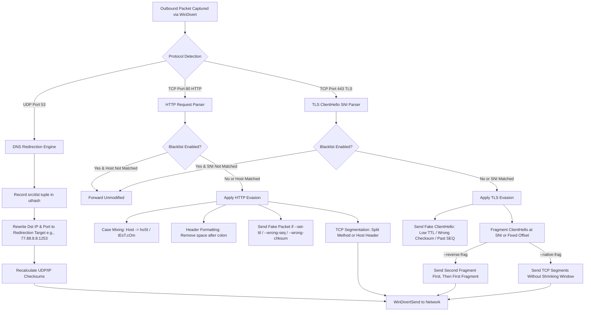

# Upstream Repository Audit & Deep Technical Analysis

## 1. Executive Summary

This document presents a comprehensive, line-by-line audit of the three primary reference repositories:
1. **Upstream GoodbyeDPI** (`ValdikSS/GoodbyeDPI` @ `v0.2.3rc3`)
2. **GoodbyeDPI-Turkey Fork** (`cagritaskn/GoodbyeDPI-Turkey` @ `release-0.2.3rc3-turkey`)
3. **WinDivert** (`basil00/WinDivert` @ `v2.2.0-D` / `v2.2.2`)

### Key Discoveries
* **Core C Codebase Parity**: The userspace C networking engine in `GoodbyeDPI-Turkey` is **100% functionally identical** to `ValdikSS/GoodbyeDPI` v0.2.3rc3. There are **zero** behavioral modifications, algorithmic changes, or new networking features in the C source files of the Turkey fork.
* **Turkey-Specific Differences**: The modifications in `GoodbyeDPI-Turkey` consist entirely of:
  1. **Inline documentation and code comments** added to C source files (in Turkish and English).
  2. **Localized Batch Scripts (`.cmd`)** configuring specific flag combinations, TTL adjustments, and Yandex DNS resolver redirects tailored to Turkish Internet Service Providers (Turkcell Superonline, Türk Telekom, Vodafone).
  3. **Repository documentation** (`README.md`, `REVERT.md`) providing Turkish guidance, ISP troubleshooting (specifically for Discord and VoIP blocks), and uninstallation steps.
* **WinDivert Integration & Privilege Boundary**: Both projects rely on WinDivert to intercept and inject packets via the Windows Filtering Platform (WFP). This requires kernel-mode driver loading (`WinDivert64.sys` / `WinDivert32.sys`) and Administrator privileges (`SeLoadDriverPrivilege`).

---

## 2. File-by-File Codebase Audit & Diff Analysis

### 2.1 File Inventory Comparison

| File Path | Upstream GoodbyeDPI | GoodbyeDPI-Turkey | Nature of Difference |
| :--- | :--- | :--- | :--- |
| `src/goodbyedpi.c` | Core logic & CLI parser | Comments added | **Documentation only**. Identical AST/logic. |
| `src/goodbyedpi.h` | Constants & signatures | Comments added | **Documentation only**. |
| `src/dnsredir.c` | UDP DNS redirection engine | Comments added | **Documentation only**. Identical DNS flow. |
| `src/dnsredir.h` | DNS structures & prototypes | Comments added | **Documentation only**. |
| `src/fakepackets.c`| Fake packet generator | Comments added | **Documentation only**. Identical SNI/hex/gen logic. |
| `src/fakepackets.h`| Fake packet prototypes | Comments added | **Documentation only**. |
| `src/ttltrack.c` | Connection tracker for auto-TTL| Comments added | **Documentation only**. Identical uthash usage. |
| `src/ttltrack.h` | Connection tracker prototypes | Comments added | **Documentation only**. |
| `src/blackwhitelist.c`| Blacklist/whitelist loader | Comments added | **Documentation only**. |
| `src/blackwhitelist.h`| List loader prototypes | Comments added | **Documentation only**. |
| `src/service.c` | Windows SCM Service wrapper | Comments added | **Documentation only**. Identical Win32 service handling. |
| `src/service.h` | Service prototypes | Comments added | **Documentation only**. |
| `src/utils/getline.c` | GNU `getline` polyfill | Formatting & comments | **Whitespace & comments only**. |
| `src/utils/getline.h` | `getline` header | Comments added | **Documentation only**. |
| `src/utils/repl_str.c`| String replace helper | Comments added | **Documentation only**. |
| `src/utils/repl_str.h`| String replace header | Comments added | **Documentation only**. |
| `src/utils/uthash.h` | Hash table macro library | Comments added | **Documentation only** (uthash 2.3.0). |
| `src/Makefile` | MinGW-w64 build makefile | Identical | Identical build targets. |
| `src/goodbyedpi-rc.rc`| Windows resource file | Identical | Identical version metadata. |
| `src/goodbyedpi.exe.manifest`| Execution level manifest | Identical | `requireAdministrator`. |
| `README.md` | English / Russian manual | Turkish guide | Comprehensive Turkish ISP documentation. |
| `REVERT.md` | None | Added in Turkey fork | Uninstallation & Windows DNS rollback guide. |

---

## 3. Deep Dive: Networking Engine & Packet Processing Flow

### 3.1 Packet Interception & WinDivert Filter Construction
GoodbyeDPI builds a WinDivert filter string dynamically based on command-line flags.

1. **HTTP/HTTPS Traffic Filter (`FILTER_STRING_TEMPLATE`)**:
   ```c
   "(tcp and !impostor and !loopback " MAXPAYLOADSIZE_TEMPLATE " and " \
   "((inbound and (" \
    "(tcp.SrcPort == 80 and (tcp.Ack or (tcp.Syn and tcp.Ack))) or " \
    "(tcp.SrcPort == 443 and tcp.Syn and tcp.Ack)" \
   ") and (" DIVERT_NO_LOCALNETSv4_SRC " or " DIVERT_NO_LOCALNETSv6_SRC ")) or " \
   "(outbound and " \
    "(tcp.DstPort == 80 or tcp.DstPort == 443) and tcp.Ack and " \
    "(" DIVERT_NO_LOCALNETSv4_DST " or " DIVERT_NO_LOCALNETSv6_DST "))" \
   "))"
   ```
   * Excludes loopback (`127.0.0.0/8`, `::1`) and local private IP ranges (`10.0.0.0/8`, `172.16.0.0/12`, `192.168.0.0/16`, `169.254.0.0/16`, `fc00::/7`, `fe80::/10`).
   * Captures outbound TCP SYN/ACK/Data on ports 80 (HTTP) and 443 (HTTPS).
   * Captures inbound TCP SYN+ACK on ports 80/443 (used by `--auto-ttl` to track the server's initial TTL and measure hop distance).

2. **Passive DPI Blocking (`FILTER_PASSIVE_STRING_TEMPLATE` & `FILTER_PASSIVE_BLOCK_QUIC`)**:
   * Drops inbound TCP RST packets with specific IP ID patterns (e.g., `0x0000`, `0x0001` commonly sent by passive DPI injectors).
   * Drops outbound QUIC Initial packets on UDP port 443 (`udp.PayloadLength >= 1200 and udp.Payload[0] >= 0xC0 and udp.Payload32[1b] == 0x01`) to force browsers to fallback from HTTP/3 to HTTP/2 or HTTP/1.1 (TCP), where DPI circumvention techniques can operate.

3. **DNS Redirection Filter (`FILTER_DNS_STRING_TEMPLATE`)**:
   * Intercepts outbound UDP packets to port 53 (`outbound and udp and udp.DstPort == 53`).
   * Intercepts inbound UDP responses from the configured redirection target.

---

### 3.2 Packet Manipulation Techniques

When an outbound HTTP request or TLS `ClientHello` packet is intercepted:



1. **Fake Request Injection**:
   * **Low TTL (`--set-ttl <val>` / `--auto-ttl`)**: Sends a dummy HTTP request or fake TLS ClientHello with a TTL just high enough to reach the ISP's intermediate DPI box, but low enough to expire before reaching the real destination server. The DPI box consumes the fake packet, resets its state machine, and lets the subsequent real request pass through.
   * **Wrong Checksum (`--wrong-chksum`)**: Transmits a fake packet with an invalid TCP checksum. Deep packet inspection appliances inspecting in-flight stream data parse it without verifying checksums (for performance reasons), whereas destination end-hosts discard it at the TCP stack.
   * **Wrong Sequence Number (`--wrong-seq`)**: Transmits a fake packet with TCP sequence/acknowledgment numbers in the past. Destination servers discard it as duplicate/out-of-window data, while naive DPI filters process it.
   * **Custom SNI Fake Packets (`--fake-with-sni <domain>`)**: Mimics a valid Firefox 130 TLS ClientHello containing a harmless SNI (e.g. `google.com`) with randomized Session IDs, grease extensions, and key shares.

2. **TCP Segmentation / Fragmentation**:
   * **SNI-level Split (`--frag-by-sni`)**: Intercepts the TLS handshake and divides the packet into two TCP segments precisely before or inside the Server Name Indication extension.
   * **Reverse Fragmentation (`--reverse-frag`)**: Sends the second segment (tail of the ClientHello) first, followed by the first segment (head). DPI filters expecting stream reconstruction in chronological order fail to inspect the SNI.

---

### 3.3 DNS Redirection Mechanics

The DNS subsystem in `dnsredir.c` acts as a transparent UDP packet proxy:
1. An application sends a standard UDP DNS query to the system's configured resolver on port 53.
2. GoodbyeDPI intercepts the query and creates an entry in a hash table (`udp_connrecord_t` via `uthash`):
   * Key: `[IP Version (1 byte)] + [Source IP (16 bytes)] + [Source Port (2 bytes)]`
   * Value: Original destination IP, destination port, timestamp.
3. The destination IP and port are rewritten to the target resolver (e.g., Yandex DNS `77.88.8.8`, port `1253`).
4. UDP and IPv4/IPv6 checksums are recalculated using `WinDivertHelperCalcChecksums`.
5. When the response arrives from `77.88.8.8:1253`, GoodbyeDPI looks up the tracking key, restores the original DNS resolver IP/port as the source, and passes the packet to the Windows network stack.
6. Upon startup/configuration change, `flush_dns_cache()` invokes `DnsFlushResolverCache()` from `dnsapi.dll`.

---

## 4. Analysis of GoodbyeDPI-Turkey Presets and Configurations

The Turkey fork achieved popularity by publishing pre-configured `.cmd` batch scripts specifically targeting Turkish ISP DPI characteristics:

### 4.1 Preset Matrix

| Script Name | Command Line Arguments | Target ISP / Scenario |
| :--- | :--- | :--- |
| `turkey_dnsredir.cmd` (Default) | `-5 --set-ttl 5 --dns-addr 77.88.8.8 --dns-port 1253 --dnsv6-addr 2a02:6b8::feed:0ff --dnsv6-port 1253` | **Default for Turkey** (Türk Telekom, Vodafone, general). Combines `-5` modeset with fixed TTL 5 and DNS redirection. |
| `turkey_dnsredir_alternative_superonline.cmd` | `--set-ttl 3` | **Turkcell Superonline Alt 1**: Pure TTL evasion with TTL=3. Assumes system DNS is manually set to clean resolver. |
| `turkey_dnsredir_alternative2_superonline.cmd` | `-5` | **Turkcell Superonline Alt 2**: Uses modeset `-5` (auto-ttl + reverse-frag + max-payload) without DNS redirection. |
| `turkey_dnsredir_alternative3_superonline.cmd` | `--set-ttl 3 --dns-addr 77.88.8.8 --dns-port 1253 --dnsv6-addr 2a02:6b8::feed:0ff --dnsv6-port 1253` | **Turkcell Superonline Alt 3**: Fixed TTL 3 + Yandex DNS redirection on port 1253. |
| `turkey_dnsredir_alternative4_superonline.cmd` | `-5 --dns-addr 77.88.8.8 --dns-port 1253 --dnsv6-addr 2a02:6b8::feed:0ff --dnsv6-port 1253` | **Turkcell Superonline Alt 4**: Modeset `-5` + Yandex DNS redirection on port 1253. |
| `turkey_dnsredir_alternative5_superonline.cmd` | `-9 --dns-addr 77.88.8.8 --dns-port 1253 --dnsv6-addr 2a02:6b8::feed:0ff --dnsv6-port 1253` | **Turkcell Superonline Alt 5**: Aggressive modeset `-9` (wrong-seq + wrong-chksum + reverse-frag + QUIC block) + DNS redirection. |
| `turkey_dnsredir_alternative6_superonline.cmd` | `-9` | **Turkcell Superonline Alt 6**: Aggressive modeset `-9` without DNS redirection. |

### 4.2 Modeset Deconstruction

* **Modeset `-5`**: `-f 2 -e 2 --auto-ttl --reverse-frag --max-payload 1200`
  * Fragments HTTP at offset 2.
  * Fragments HTTPS ClientHello at offset 2.
  * Automatically detects server hop distance and adjusts fake packet TTL.
  * Reverses TCP fragment transmission order.
  * Limits processing to packets with payload $\le$ 1200 bytes.
* **Modeset `-9`**: `-f 2 -e 2 --wrong-seq --wrong-chksum --reverse-frag --max-payload 1200 -q`
  * Combines wrong sequence numbers and wrong checksums.
  * Reverses fragment order.
  * Blocks QUIC / UDP 443 traffic to force TCP.

---

## 5. Architectural Deficiencies & Replacement Strategy

While GoodbyeDPI is effective, the upstream and Turkey fork implementations suffer from critical architectural deficiencies that make them unsuitable as modern desktop software:

| Component | Upstream / Turkey Fork Limitation | Our Target Implementation |
| :--- | :--- | :--- |
| **Control Interface** | Relies on raw `.cmd` shell scripts, `pause`, and `sc.exe` invocations. | Robust Windows Service written in Rust with typed Named Pipe IPC and unprivileged Tauri GUI. |
| **Configuration** | Command-line arguments scattered across 14 batch files; cannot modify settings without stopping/restarting scripts. | Structured JSON/YAML configuration engine with schema validation and hot-reloading profiles. |
| **Process Model** | Console window must remain open, or an unmonitored Windows service is installed that cannot report errors or status. | Privileged background service managing an isolated worker process inside a Windows Job Object. |
| **DNS Management** | Only supports raw UDP redirection to port 1253. Requires user to manually edit Windows adapter DNS settings. | Native DNS client supporting DoH (DNS-over-HTTPS), DoT (DNS-over-TLS), and automatic Windows adapter DNS configuration with atomic rollback on exit. |
| **Observability** | Only unformatted `printf` debug statements to stdout. | Structured logging (tracing/OpenTelemetry), real-time packet & connection metrics, and latency diagnostics. |
| **Crash Safety** | A segfault in C terminates the entire process and drops network filtering without cleanup. | Process crash isolation; watchdog monitoring; auto-restart and fail-safe driver unloading. |
| **Supply Chain** | Users download untrusted precompiled ZIP files containing foreign `.exe`, `.dll`, and `.sys` binaries. | 100% reproducible source-built userspace engine, pinned signed WinDivert driver with SHA-256 verification, and automated CI pipelines. |

---

## 6. Audit Conclusion & Recommendations

1. **Discard Batch Scripts**: Convert all 14 Turkey/Upstream `.cmd` scripts into structured profile definitions (`profiles/turkey/*.json`).
2. **Re-use Upstream C Source for v0.1**: The userspace C code from `ValdikSS/GoodbyeDPI` v0.2.3rc3 is solid, battle-tested, and clean. We should vendor/build it from source in `engines/goodbye/`.
3. **Encapsulate in Process Boundary**: Run the C engine as an isolated worker process controlled by our Rust service for v0.1.
4. **Prepare Native Engine**: Build our modular packet processing architecture in `core/packet-engine` and `engines/native` to progressively replace the C codebase in subsequent milestones.
